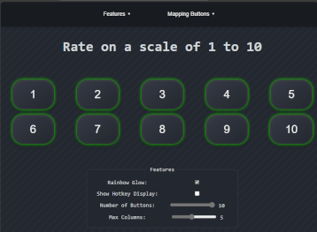
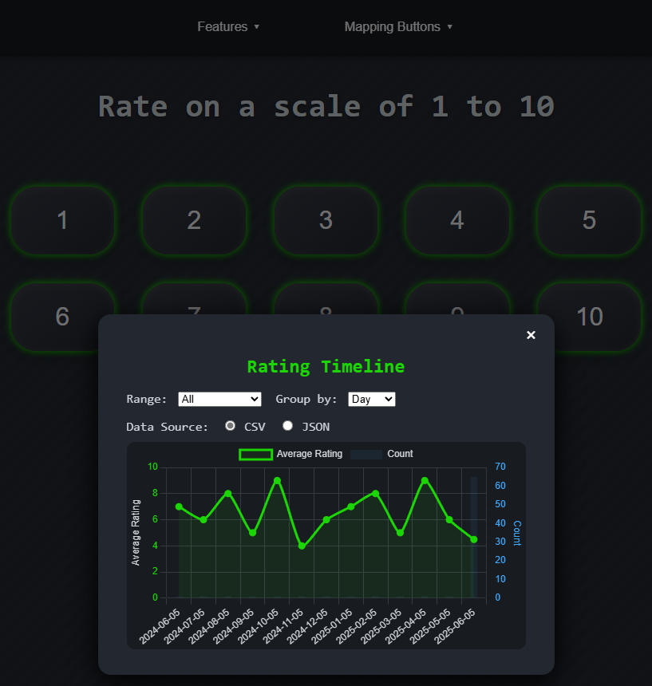

# RateIt

It's meant to be a simple app made to intake ratings from users. HotKeys can be set for buttons if the situation is to take rating as people walk by.

<p align="center">
  
  
</p>

## Features

- **Web App**: Accessible via browser
- **Customizable Hotkey mapping**
- **Theme Customization**
- ~~**Desktop GUI**: PyQt6-based, easy to use, supports hotkey mapping and rating.~~ WIP
- **Data Storage**: Downloadable and uploadable, ratings are saved to both `ratings.csv` and `ratings.json`.
- **Graphing**: Built-in graphing in the web interface with filtering/grouping options.
- **Docker Support**: Run the web app in a container with HTTPS and persistent volume mapping.
- **Customizable**: Easily modify hotkeys, number of buttons, and enable/disable Random Hover/Select.

## Quick Start
### Compose Build
```bash
git clone http://github.com/jonesckevin/rateit.git
cd rateit
docker compose up --build -d
```

### From DockerHub
```bash
docker run -it -d -p 7331:7331 \
  --name rateit-app \
  --hostname rateit-app \
  jonesckevin/rateit:latest
```
---

```bash
docker run -it -d -p 7331:7331 \
  --name rateit-app \
  --hostname rateit-app \
  rateit-app
```


### Portainer Example


