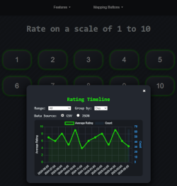

# RateIt

RateIt is a Python-based quick rating system with both a web interface (Flask) and a desktop GUI (PyQt6). It allows you to rate events, map hotkeys (including external controllers), and stores ratings in both CSV and JSON formats for easy access and graphing.

<p align="center">
  
  
</p>


## Features

- **Web App**: Accessible via browser, supports hotkey mapping, theme customization, and graphing of ratings.
- ~~**Desktop GUI**: PyQt6-based, easy to use, supports hotkey mapping and rating.~~ WIP
- **Data Storage**: All ratings are saved to both `ratings.csv` and `ratings.json`.
- **Graphing**: Built-in graphing in the web interface with filtering/grouping options.
- **Docker Support**: Run the web app in a container with HTTPS and persistent volume mapping.
- **Customizable**: Easily modify hotkeys, number of buttons, and more.

## Installation
### Quick Start

```bash
git clone http://github.com/jonesckevin/rateit.git
cd rateit
docker compose up -d

```
### Requirements

- Python 3.8+
- (For GUI) PyQt6
- (For Web) Flask

### Install dependencies

```bash
pip install flask pyqt6
```

Or use a `requirements.txt` if provided.

### Run the Web App (Development)

```bash
python main_web.py
```

Then open [http://localhost:7331](http://localhost:7331).

### Run the Web App (Production with Gunicorn)

Install dependencies (including gunicorn):

```bash
pip install -r requirements.txt
```

Run with gunicorn (recommended for production):

```bash
gunicorn -b 0.0.0.0:7331 main_web:app
```

Then open [http://localhost:7331](http://localhost:7331).

### Run the GUI App using or Flask

```bash
# Python
python main_gui.py
```

### Docker (Web App with HTTPS)

Build the image:

```bash
docker build -t rateit-app .
```

Run the container (with volume mappings for live file/data access):

```bash
docker run -it -d -p 7331:7331 \
  --name rateit-app \
  --hostname rateit-app \
  rateit-app
```

- The web app will be available at [https://localhost:7331](https://localhost:7331)
- You may need to accept the self-signed certificate in your browser.

To use your own SSL, copy your `cert.pem` and `key.pem` files to a directory (e.g., `/certs/`).
```bash
docker cp rateit-app:/certs/cert.pem /certs/
docker cp rateit-app:/certs/key.pem /certs/
```

### Docker Compose Example

```yaml
services:
  rateit-app:
    image: jonesckevin/rateit:latest
    restart: unless-stopped
    container_name: rateit-app
    hostname: rateit-app
    ports: 
      - "7331:7331"
    environment:
      - FLASK_RUN_HOST=0.0.0.0    
```
### Docker Compose Portainer Via Git
1. Set `Stack` name to `rateit-app`
2. Select `Git Repository` as the source
3. Set `Repository URL` to `https://github.com/Jonesckevin/RateIt`
4. Set Compose Path to `docker-compose-build.yml`


## Usage

- **Web**: Access via browser, use the menu to map hotkeys, customize theme, and view graphs.
- **Production**: For public or production deployments, always use a WSGI server like gunicorn (see above).
- **GUI**: Use the desktop app, map hotkeys, and rate with buttons or mapped keys.
- **Data**: All ratings are saved to both CSV and JSON for easy analysis.

## Notes

- All data/config files are stored in the project directory and can be mapped as Docker volumes for persistence and easy modification.
- The web app supports HTTPS with a self-signed certificate by default in Docker.
- You can use external controllers by mapping their keys to ratings.

---
